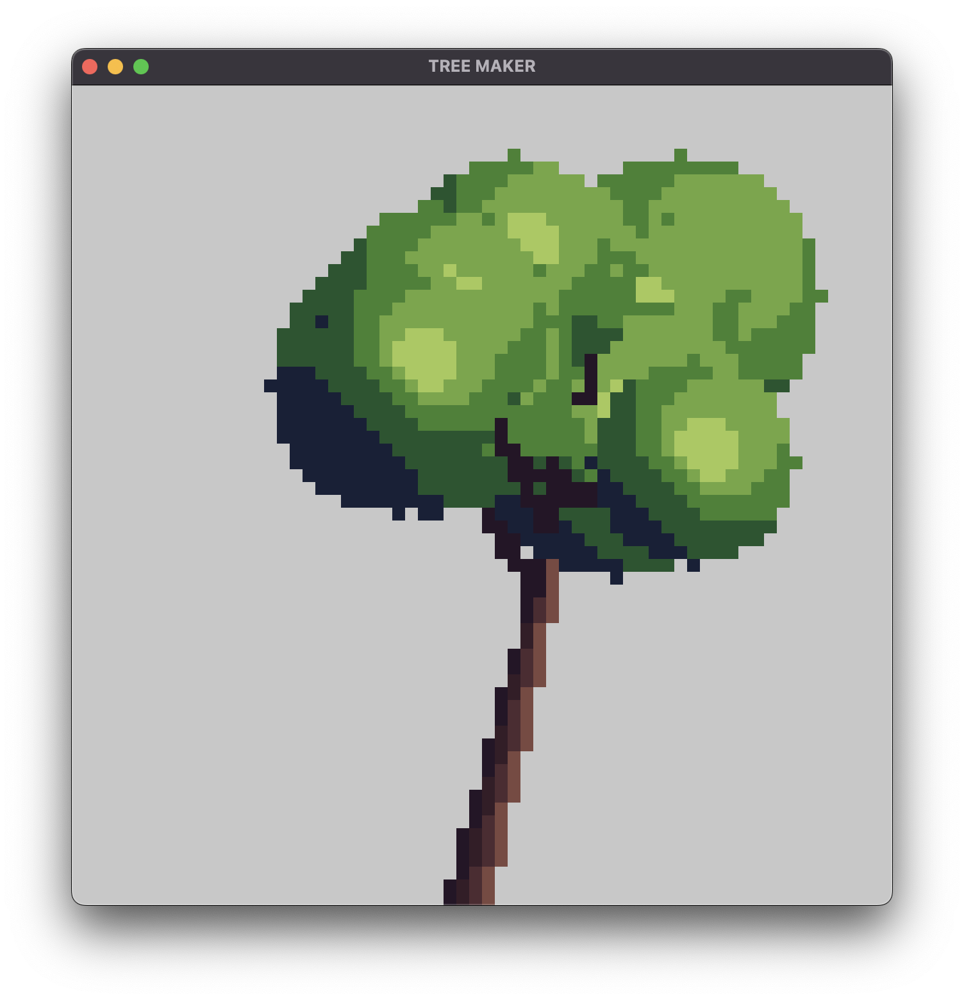
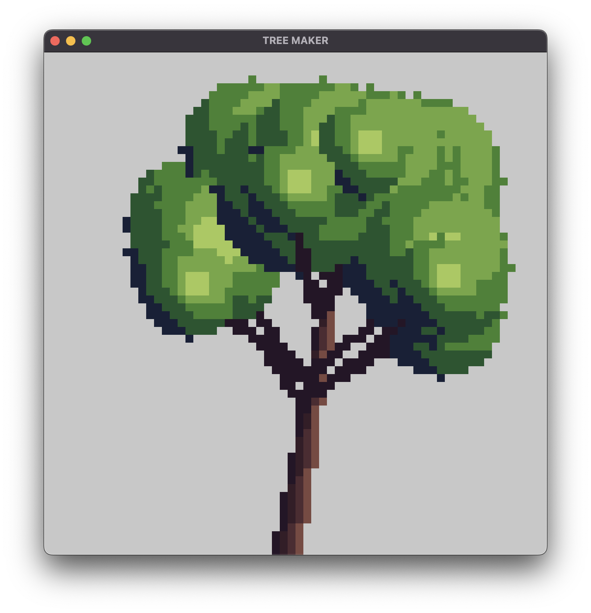

# PixelArtTreeGenerator
An executable that allows the user to generate and save pixel art trees as png assets

## Description 
Use this program to create 64 x 64 pixel trees and save them as .pngs for use on whatever project you'd like.

## Steps to Use

1. Download the zip file
2. Extract the file
3. Open up the executable 
4. Press "R" to generate trees 
5. Press "S" to save the tree as a png

#

    
    
    
    
    
    
    
    

#

    
    

